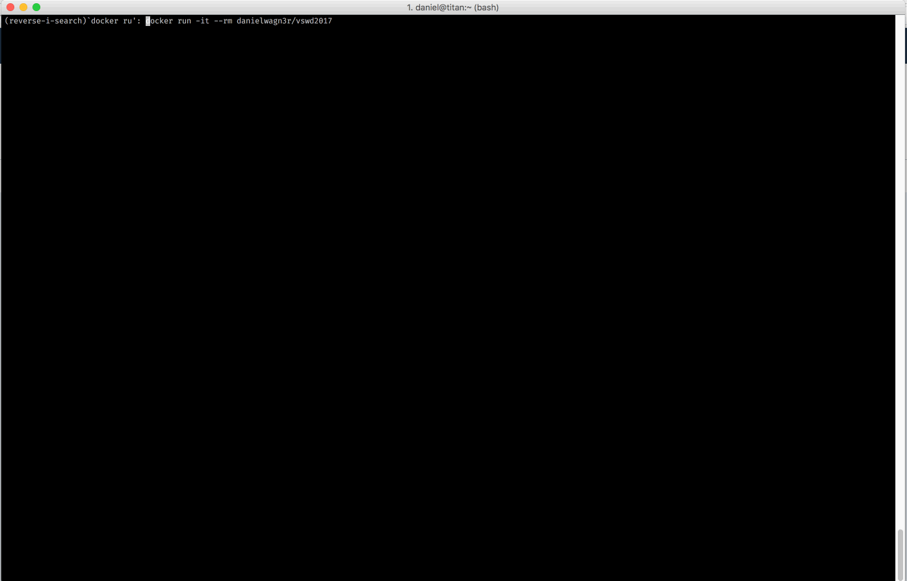

## [CoderDojo](http://wien.coderdojo.net) - The next generation Developers

Talk beim [VÖSI Software Day 2017](http://softwareday.voesi.or.at/) über [CoderDojo Wien](http://wien.coderdojo.net) und die Idee dahinter.

Gemeinsames Entdecken, Teamarbeit, Mentoring sowie selbstorganisiertes Lernen und Experimentieren stehen im CoderDojo im Vordergrund. Offenheit, gegenseitiges Helfen und das Weitergeben von erworbenem Wissen sind wichtige Grundprinzipien. An oberster Stelle steht aber die Förderung von Kreativität und Spaß an Technologie. Softwareentwicklung in einer Gemeinschaft soll Spaß machen, cool sein und den Kindern neue Perspektiven in einer Welt eröffnen, die immer mehr von Technologie, Computern und Software geprägt ist.

Contact us on:

Email: hallo@wien.coderdojo.net
Facebook: https://fb.me/CoderDojoWien
Twitter: https://twitter.com/CoderDojoWien


### Preview



### Quickstart

#### Prerequisites

I used an experimental feature of [iTerm](https://www.iterm2.com/) to cat images to the terminal for this talk. Please install a recent beta version to enjoy all visuals :wink:

#### Step 1

Pull the latest image:

```
docker pull danielwagn3r/vswd2017:latest
```

#### Step 2

Run the presentation:

```
docker run -it --rm danielwagn3r/vswd2017:latest
```